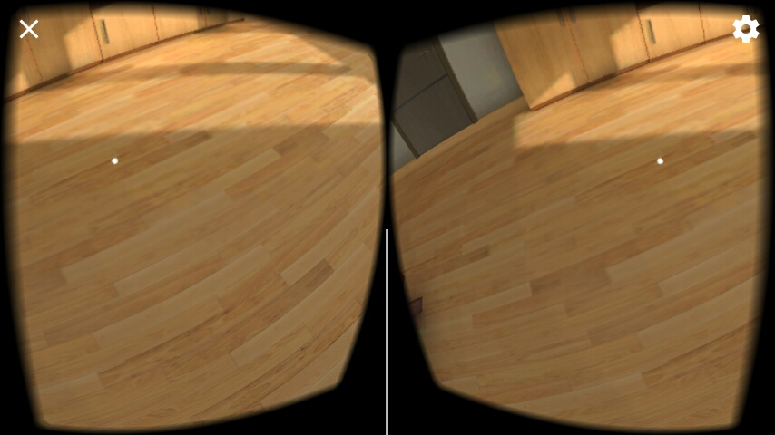
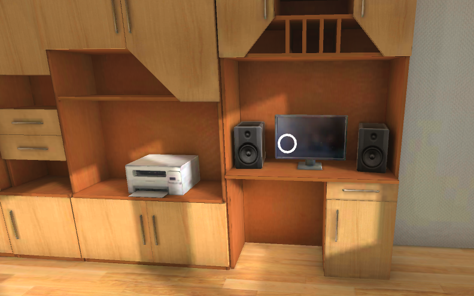

This is a simple VR project. The user can interact with some object, for example turn on and of a tv or a computer. It uses Google VR libary and is ported to Android. The apk file is in the root directory.

  
  

